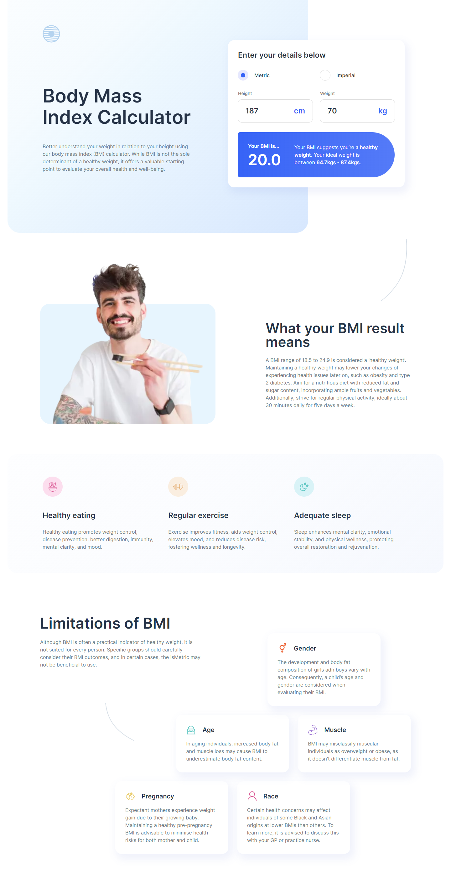

## Welcome! 👋

Thanks for checking out this project.

## Table of contents

- [Overview](#overview)
  - [Preview Screenshot](#preview-screenshot)
  - [Links](#links)
- [My process](#my-process)
  - [Built with](#built-with)
- [Author](#author)

## Overview

### Preview Screenshot

### Links

- Solution URL: [github.com/lucasweidas/bmi-calculator](https://github.com/lucasweidas/bmi-calculator)
- Live Site URL: [bmi-calculator.vercel/](https://bmi-calculator-gules.vercel.app/)

## My process

### Built with

- TypeScript
- React
- NextJS
- TailwindCSS

## Author

- Github - [@lucasweidas](https://github.com/LucasWeidas)
- Frontend Mentor - [@lucasweidas](https://www.frontendmentor.io/profile/lucasweidas)
